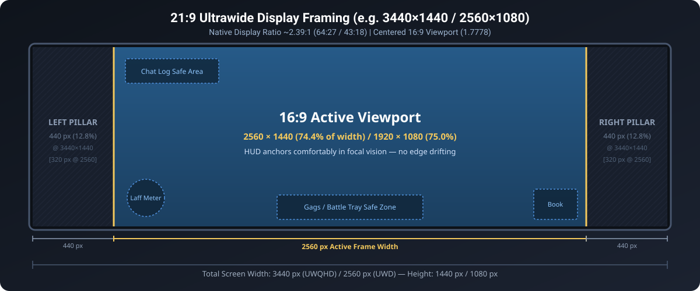
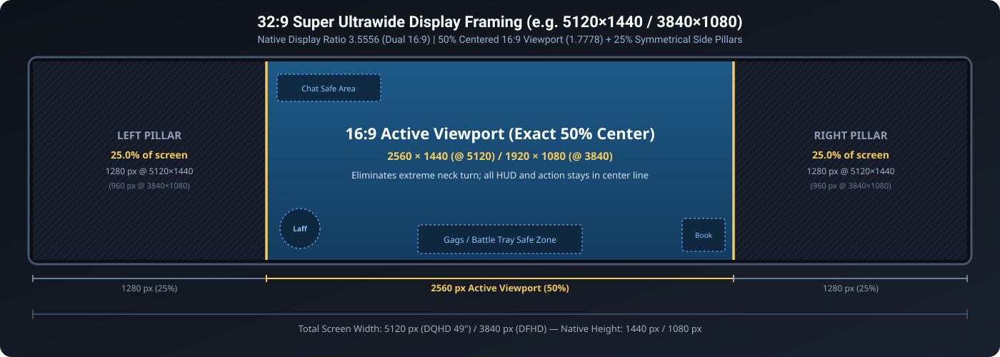
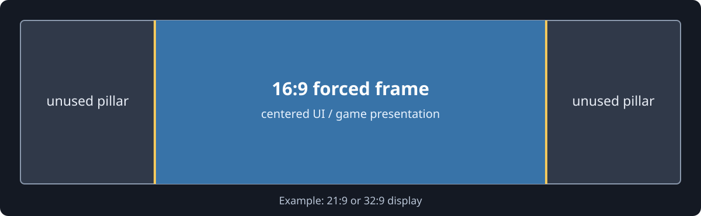

# Display framing diagrams

When Toontown Rewritten’s experimental `video.forced-aspect-ratio` is set to `1.7777777777777777` (16:9), the client centers the 3D rendering and 2D interface within a 16:9 viewport. On displays wider than 16:9, symmetrical black pillarboxes fill the unused side space.

---

## 1. 21:9 Ultrawide Displays (~2.39:1 / 64:27 / 43:18)

Common resolutions: **3440×1440** (UWQHD), **2560×1080** (UWD), **3840×1600** (UW4K).

On a 21:9 monitor, the 16:9 active viewport spans approximately **74.4% to 75.0%** of the screen width, flanked by symmetrical **12.5% to 12.8%** side pillars.



### 21:9 ASCII Framing Diagram

```text
|<----------------------------- 21:9 Physical Display (3440 px) ----------------------------->|
+--------------------+---------------------------------------------------+--------------------+
|    LEFT PILLAR     |               16:9 ACTIVE VIEWPORT                |    RIGHT PILLAR    |
|   (Unused Area)    |                 (Game & HUD Area)                 |   (Unused Area)    |
|                    |                                                   |                    |
|   440 px (12.8%)   |  [Chat Log]                                       |   440 px (12.8%)   |
|   @ 3440×1440      |                                                   |   @ 3440×1440      |
|                    |                                                   |                    |
|   320 px (12.5%)   |                                                   |   320 px (12.5%)   |
|   @ 2560×1080      |                                                   |   @ 2560×1080      |
|                    |  (Laff Meter)      [Gag / Battle Tray]     [Book] |                    |
+--------------------+---------------------------------------------------+--------------------+
|<-- 440 px (12.8%) ->|<------------- 2560 px Active Width (74.4%) ------->|<-- 440 px (12.8%) ->|
```

### 21:9 Geometry Breakdown

| Resolution | Screen Width | Screen Height | 16:9 Frame Width | Pillar Width (Each Side) | Active Area % |
|:---|---:|---:|---:|---:|---:|
| **2560×1080** (UWD) | 2560 px | 1080 px | 1920 px | 320 px | 75.0% |
| **3440×1440** (UWQHD) | 3440 px | 1440 px | 2560 px | 440 px | 74.4% |
| **3840×1600** (UW4K) | 3840 px | 1600 px | 2844 px | 498 px | 74.1% |

---

## 2. 32:9 Super Ultrawide Displays (3.5556:1 / Dual 16:9)

Common resolutions: **5120×1440** (DQHD 49"), **3840×1080** (DFHD).

A 32:9 display is mathematically equivalent to two 16:9 monitors side-by-side. With the 16:9 aspect lock active, the game viewport occupies **exactly the center 50%** of the screen width, with **exactly 25%** pillarboxes on the left and right.



### 32:9 ASCII Framing Diagram

```text
|<--------------------------------- 32:9 Super Ultrawide (5120 px) --------------------------------->|
+-----------------------------+-----------------------------------------+-----------------------------+
|         LEFT PILLAR         |          16:9 ACTIVE VIEWPORT           |        RIGHT PILLAR         |
|        (Unused Area)        |            (Center 50% Frame)           |        (Unused Area)        |
|                             |                                         |                             |
|      1280 px (25.0%)        |  [Chat Log]                             |      1280 px (25.0%)        |
|      @ 5120×1440            |                                         |      @ 5120×1440            |
|                             |                                         |                             |
|       960 px (25.0%)        |                                         |       960 px (25.0%)        |
|      @ 3840×1080            |                                         |      @ 3840×1080            |
|                             |  (Laff)       [Gags / Battle]    [Book] |                             |
+-----------------------------+-----------------------------------------+-----------------------------+
|<----- 1280 px (25.0%) ----->|<------ 2560 px Active Width (50.0%) ---->|<----- 1280 px (25.0%) ----->|
```

### 32:9 Geometry Breakdown

| Resolution | Screen Width | Screen Height | 16:9 Frame Width | Pillar Width (Each Side) | Active Area % |
|:---|---:|---:|---:|---:|---:|
| **3840×1080** (DFHD) | 3840 px | 1080 px | 1920 px | 960 px | 50.0% |
| **5120×1440** (DQHD) | 5120 px | 1440 px | 2560 px | 1280 px | 50.0% |

### Why 32:9 Players Use 16:9 Aspect Lock
- **Ergonomics**: Without aspect lock, the Laff meter is pinned to the far bottom-left and the Shticker book to the far bottom-right of a 49-inch curved monitor. Checking health requires physically turning your head away from battle action.
- **UI Distortion Prevention**: TTR’s Panda3D engine UI anchors (`aspect2d`) stretch or misalign dialog boxes, gag select menus, and fishing/cog interfaces when aspect ratios exceed 16:9.
- **Accurate Hitboxes**: Keeps mouse click coordinates and GUI buttons in exact 16:9 alignment.

---

## 3. General Overview Diagram

The original unified diagram below highlights the centering principle across all wide formats:



---

## 4. UI Anchor Placement & Safe Zones

In standard Toontown Rewritten rendering, HUD elements attach to the edges of Panda3D’s 2D scene graph:

```text
(-1.78, 1.0) [Chat Log]                            [Street/Zone Title] (+1.78, 1.0)
     +--------------------------------------------------------------------+
     |                                                                    |
     |                         3D Render World                            |
     |                                                                    |
     |                                                                    |
     | (Laff Meter)             [Gag Tray / Battle]        [Shticker Book]|
     +--------------------------------------------------------------------+
(-1.78, -1.0)                                                      (+1.78, -1.0)
```

With `video.forced-aspect-ratio = 1.7777777777777777`, the coordinate system bounds remain strictly bounded between `X = -1.7778` and `X = +1.7778` regardless of monitor width.

For exact pixel numbers for other aspect ratios (such as 16:10 or 4:3 letterboxing), see [RESOLUTION_MATRIX.md](RESOLUTION_MATRIX.md).
For answers to common questions about pillarbox behavior, see [FAQ.md](FAQ.md).
